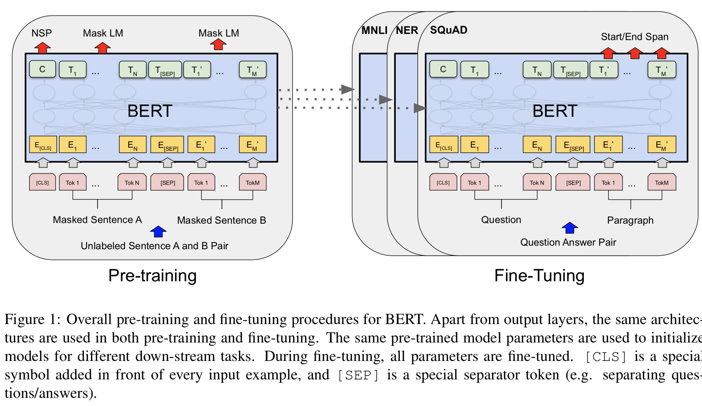
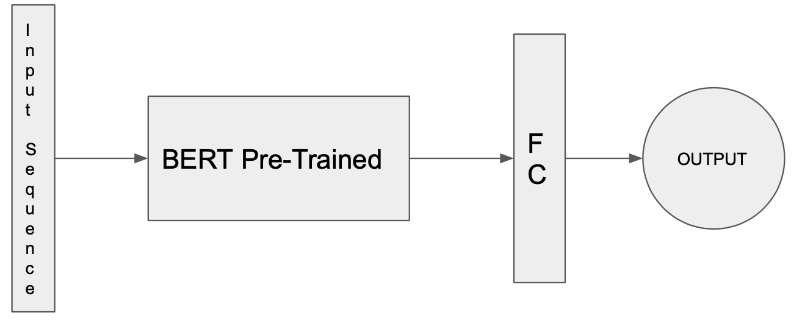
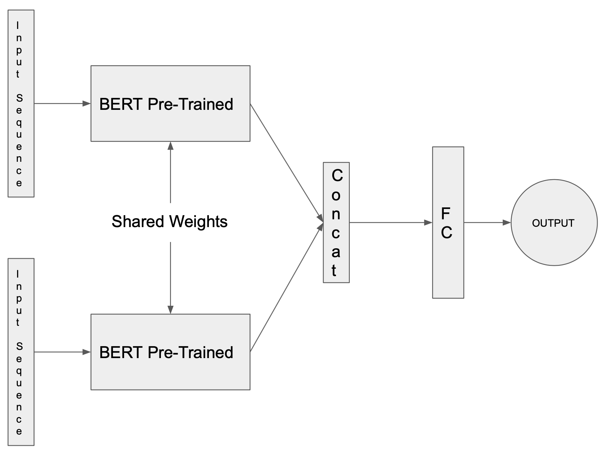

# Fake News Classification on LIAR-PLUS Dataset using Triple Branch Siamese Network with BERT as the base network

## Files

1. [`bert_siamese.py`](bert_siamese.py) - Code to train the binary/six-way classifier

2. [`main_attention.py`](main_attention.py) - Keras code for Attention model (Need not be trained)

3. [`Fake_News_classification.pdf`](Fake_News_classification.pdf) - Explanation about the architectures and techniques used

4. [`requirements.txt`](requirements.txt) - File to install all the dependencies

## Usage

Install Python3.5 (Should also work for python>3.5)

Then install the requirements by running

``` bash
$ pip3 install -r requirements.txt
```

To run the training code, first download the dataset into your HOME directory by running

``` bash
$ git clone https://github.com/Tariq60/LIAR-PLUS.git ~/LIAR-PLUS
```

Now to run the training code for binary classification, execute

``` bash
$ python3 bert_siamese.py -num_labels 2
```

Now to run the training code for 6 class classification, execute

``` bash
$ python3 bert_siamese.py -num_labels 6
```

## Now Let's Discuss

### Highest Accuracy I was able to achieve

<p align="center">
    
</p>

### Model Architectures tried

**Note**: I will be referring to [Where is your Evidence: Improving Fact-checking by Justification Modeling](https://aclweb.org/anthology/W18-5513) as “the dataset paper” or “the LIAR-PLUS dataset paper” throughout this documentation.

As presented in the dataset paper, where they have employed “enhanced claim/statement representation that captures additional information shown to be useful such as hedging” but I haven't done anything like they mentioned in the paper because I wanted to check whether the state of the art language modeling algorithm can do good on a very complex classification task like the fake news classification. From my experiments I found that BERT can be finetuned to work on classification to some extent.

I have experimented with different training strategies with BERT as the base architecture which I have fine tuned for text classification (In this case fake news classification).

I chose BERT as the base architecture because state of the art performance in Language Translation and Language Modeling tasks. I thought I would be a good idea to leverage its pretrained weights as finetine it to the task of text classification.

<p align="center">
    
</p>

Below are the three training strategies and Architectures used to get the desired results.

#### 1. Finetuning BERT:

<p align="center">
    
</p>

Finetuned the BERT architecture for classification by passing the tensor from BERT into a Linear layer (fully connected layer) which gives a Binary output logits.

Here only the news statements are used for training the network. No metadata or the justification data has been used.

Through this, I was able to achieve around 60% accuracy on the binary classification task.

#### 2. A Siamese Network with BERT as the base network:

<p align="center">
    
</p>

Built a siamese network with two branches with each branch containing BERT as the base models.

Input of the first branch will be the tokens corresponding to the news statements on which we need to predict the labels. Input of the second branch will be the tokens corresponding to the justification of the particular news statement passed to the first branch.

The output of each BERT layer branch will be a 1D tensor of shape (768). As we have two branches we will get two 1D tensors of shape (768). Now these two outputs are concatenated and passed through a Linear layer(fully connected layer), from this we get two logits and a ‘softmax’ activation is applied to get the output probabilities.

In this architecture, both branches share the same weights between them.

*This approach is used particularly to leverage the additional information we have, In this case the ‘justifications’.
This method gave a binary classification accuracy of 65.4%.*

*In case of 6 classification, this method achieved an accuracy of 23.6% which is improved a lot in the next method.*

#### 3. Triple Branch Siamese Network with BERT as the base network:

<p align="center">
    
</p>

Here the architecture is similar to the one in the previous case, but here I have added one bore branch with BERT as the base network to the siamese network in the previous case making this a Triple Branch Siamese network. The input to this additional branch will be the remaining meta data available like speaker, source, affiliation, etc. apart from the justification.

The second change/addition here is taking into account the authenticity of the publisher. 

For this purpose I have defined a feature called “**Credit Score**”.

As given in the dataset documentation, the columns 9-13 in the dataset correspond to the number of ​barely true counts, false counts, half true counts, mostly true counts, pants on fire counts made by the news source.

So the Credit score is calculated as,

A = [(mostly true counts)*0.2 + (half true counts)*0.5 + (barely true counts)*0.75 + (false counts)*0.9 + (pants on fire counts)*1]

B = [mostly true counts + half true counts + barely true counts + false counts) + pants on fire counts]

Credit_score = A / B

The credit score tells us about how false or fake the news published by that author or the source is on average.

This credit score is multiplied to the tensor resulting from the concatenation of the output tensors from all three branches of the siamese network. And then multiplied 1D tensor is passed through a fully connected layers to get two logits a outputs.

The reason why I used this credit score is to sort of increase the relative difference between the output activations between the fake and the real cases (As the credit score will be high incase of a publisher who publishes fake news compared to the someone who does less.)

For binary classification, the model wasn’t able to learn at all on the training data as the loss is also constant throughput the training. This can be due to the reason that there are many moving parts here like the credit_score integration, meta data integration, etc. and due to this, tweaking the network and learning parameters became difficult. Also because of limited computing resources available with me and the huge training times the network is taking, I was not able to properly tweak different parameters and couldn’t experiment with different strategies of combining the meta data with the news statements and justification.

I believe that, if some time can be invested in this method, there will be some goods gains in accuracy.

Quite different from the binary classification, there was an improvement in accuracy in the case of 6 class classification to 32.8%.

Two further modifications have been made to this method giving better results. They are discussed below.

**Modification1**: Added the credit scores to the output of the concatenation layer instead of multiplication. And decreasing the learning rate by 5 times.

**Modification2**: Instead of giving inputs of same sequence sizes (128) to all three branches, I changed the input sequence size depending on the type of data and the average number of words in them. For the branch which takes news statements as input, the sequence size is 64 as there are only 5-10 input sequences with more than 64 words in them. For the branch which takes justifications as input, the sequence size is 256 as many of the justifications have 128 to 264 words and there are only around 10 input sequences with more than 264 words in them. And same with metadata input for which the input sequence size is fixed to 32 as there are zero inputs with more than 32 words in them. This also allowed me to use the GPU memory more efficiently.

These modifications resolved the problem of network not learning in case of binary classification and improved the six-way classification accuracy by a large margin.

<p align="center">
    
</p>

### References

1. [Keras: The Python Deep Learning library](https://keras.io)
2. [Keras Tutorial on Glove embedding](https://keras.io/examples/pretrained_word_embeddings/)
3. [A library of state-of-the-art pretrained models for Natural Language Processing](https://github.com/huggingface/pytorch-transformers)
4. [Pytorch Deep Learning framework](https://github.com/pytorch/pytorch)
5. [Pytorch BERT usage example](https://github.com/sugi-chan/custom_bert_pipeline)
6. [Attention Is All You Need](https://arxiv.org/abs/1706.03762)
7. [Blog on attention networks in Keras](https://androidkt.com/text-classification-using-attention-mechanism-in-keras/)
8. [BERT: Pre-training of Deep Bidirectional Transformers for Language
Understanding](https://arxiv.org/abs/1810.04805)
9. [Example on Siamese networks in pytorch](https://innovationincubator.com/siamese-neural-network-with-pytorch-code-example/)
10. [LIAR-PLUS dataset](https://github.com/Tariq60/LIAR-PLUS)
(https://aclweb.org/anthology/W18-5513) 
11. [GloVe: Global Vectors for Word Representation](https://nlp.stanford.edu/projects/glove/)
